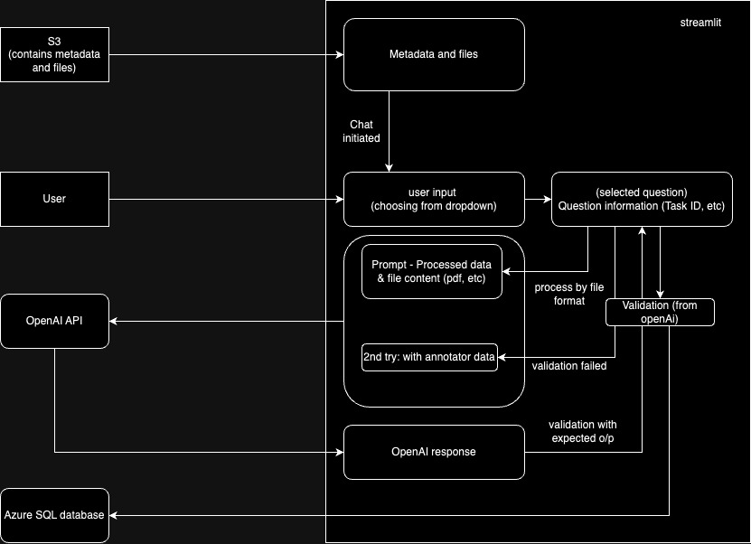

# Assignment1

## Links
1. [Diagrams](#diagrams)
2. [Codelabs Document](https://codelabs-preview.appspot.com/?file_id=12x51PlTxUmD6F9uAui8ZyoWTlUt4VTFP3YCYAvrLZq4)
3. [Video of the submission](https://youtu.be/hQujEXRkhJw)
4. [Working app](https://intelligentapp.streamlit.app/)
5. [Github URL](https://github.com/BigData-Fall2024-TeamA3/Assignment1/tree/main)

# About
AI powers almost every interaction online. Businesses use LLM to deliver customized and innovative service to their customers. LLM vendors also announce a new model every few months now with promises of better performance.However, the most important question is how reliable, accurate, and well the models perform.

Our project is a chat tool designed for analysts and engineers. We aim for this application to serve as a platform for exploring and interacting with LLM and large datasets and providing visualizations about the model's performance.

## Problem statement
GAIA is one of the best benchmarking datasets for agents. The questions in the dataset are categorized based on their level of difficulty. Using this dataset, we plan to build a platform for analysts and engineers to analyze the LLM performance based on the interactions.

The available vendor is currently limited to OPENAI and the use case is assumed to be validation data from the "GAIA dataset"

## Key components and roles

**GAIA dataset**: Sourced from Huggingface and will serve as our data to sample the dataset
**Streamlit**: Framework that powers our user interface and backend components (APIs, etc). We chose Streamlit for its flexibility and ease of use in creating web apps in Python
**Amazon S3**: S3 offers secure and scalable storage for storing metadata and other input files.
**OpenAI API**: This is currently one of the best LLM models for generating responses to queries with various difficulty and complexity
**Azure SQL database**: We utilize Azure's seamless integration capabilities to store AI responses and other data relating to these responses.
**Specialized libraries**: PyPDF2, Pytessaract, and pandas to handle extracting data from files of various formats(pdf, excel, etc.). Boto3, Pyodbc to handle db interactions and operations

## Diagrams

### Architecture


### UI

#### Login page


#### Sign up page


#### User chat Interface


### Visualizations

#### Response trend


#### Response distribution by difficulty level


#### Response distribution by difficulty level


# Setup instructions

## Pre-reqs

Poetry, ODBC driver for sql server (msodbcsql17), tesseract

## Steps

1. clone repo

```

git clone git@github.com:BigData-Fall2024-TeamA3/Assignment1.git

```

  

2. Install dependencies

```

poetry install

```

3. Create .streamlit/secrets.toml file for following

```

OPENAI_API_KEY = ""

s3_file_key_path = "path/to/your/files/"

bucket_name = ''

s3_file_key = 'path/to/your/metadata.jsonl'

s3_file_url = ''

aws_access_key_id = ''

aws_secret_access_key = ''

  

# Azure Connection details

server = ''

database = ''

username = ''

password = ''

driver = ''

  

```

  

4. Run streamlit app

```

poetry run streamlit run app.py

```
# Engineering





The diagram describes the overview of the dataflow within the app. The frontend and the backend components are built on Streamlit.
The validation dataset/metadata and relevant files are stored on the S3 bucket in a JSON file and are loaded for dropdown questions

```python
        metadata_df = load_jsonl_from_s3(bucket_name, s3_file_key)
```

On logging into the platform, The user selects a question from the dropdown (user input).
On selecting a question, data retrieval of the relevant file is triggered from S3 bucket. We use AWS’s Boto3 library to achieve this.

```python
	file_content = download_file_from_s3(bucket_name, file_path)
```

The data is now processed based on their type. 
The attachments are first processed based on their type. They are first extracted into text information, further tokenized and truncated before the processed query (the created prompt) is sent to OpenAI API
```python
processed_content = process_file_based_on_extension(file_content, file_extension)
```


The file processing functions to extract text data
```python
extract_text_from_pdf(file_content, file_extension)
extract_text_from_image(image_content)
extract_text_from_xlsx()
extract_text_from_python_script()
```

The processed data (prompt) is then sent OpenAI for analysis
```python
openai_response = ask_openai(selected_question, processed_content)
```


The OpenAI response is validated against the existing dataset and stored on “azure sql database”. This output is displayed to the user (frontend)
```python
insert_or_update_metadata(task_id, task_level, direct_response, annotator_response)
```

This data is later queried from azure for visualizations
```python
fetch_data_from_azure()
```

 
Backend architecture, APIs and Visualizations
Frontend and backend is handled by streamlit
OpenAI API and AWS use python libraries (openai-python, Boto3)
Azure SQL storage utilizes pyobdc for database operations
Plotly is used for visualizations that summarize our response statistics

```python
# example
px.histogram(data, x_label, y_label, ...)
```


Challenges
Handling large data files: One of the bottlenecks were the token limits enforces by the OpenAI API. This is handled by tokenizing and truncating the data before sending the data.
```python

def truncate_prompt(prompt, max_tokens):
       """Truncates the prompt to fit within the allowed token limit."""
       tokens = tokenizer.encode(prompt)
      
       # If prompt tokens exceed the max, truncate it
       if len(tokens) > max_tokens:
           truncated_tokens = tokens[:max_tokens]
           truncated_prompt = tokenizer.decode(truncated_tokens)
           return truncated_prompt
       return prompt


```


Error handling and Multiple file extensions: Extracting data from various file formats is difficult. This is handled by identifying the file format and further process them individually and in a manner best suited for each format. 
pytessaract package is used to process image content to text content.
Pypdf package is used for process pdf files to text.
Pandas package is used to process excel.


# References

1. https://docs.streamlit.io/develop
    1. https://docs.streamlit.io/develop/tutorials/multipage
    2. https://docs.streamlit.io/develop/api-reference/charts/st.plotly_chart
    3. https://docs.streamlit.io/develop/tutorials/databases/aws-s3 
2. https://learn.microsoft.com/en-us/azure/azure-sql/?view=azuresql
3. https://boto3.amazonaws.com/v1/documentation/api/latest/guide/s3-examples.html
4. https://github.com/openai/openai-python
5. https://docs.google.com/document/d/12x51PlTxUmD6F9uAui8ZyoWTlUt4VTFP3YCYAvrLZq4/edit?usp=sharing
6. https://github.com/openai/openai-python/tree/main/examples
